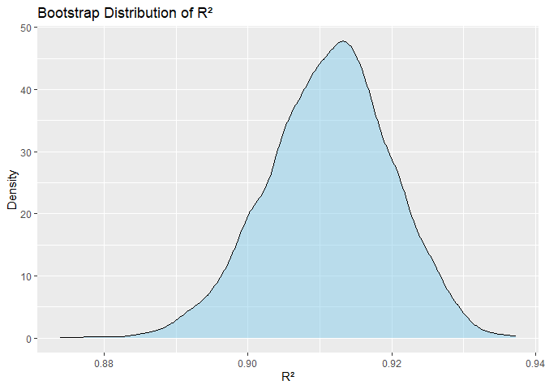

P8105_hw6_zz3309
================
Zebang Zhang
2024-12-2

``` r
library(tidyverse)
```

    ## ── Attaching core tidyverse packages ──────────────────────── tidyverse 2.0.0 ──
    ## ✔ dplyr     1.1.4     ✔ readr     2.1.5
    ## ✔ forcats   1.0.0     ✔ stringr   1.5.1
    ## ✔ ggplot2   3.5.1     ✔ tibble    3.2.1
    ## ✔ lubridate 1.9.3     ✔ tidyr     1.3.1
    ## ✔ purrr     1.0.2     
    ## ── Conflicts ────────────────────────────────────────── tidyverse_conflicts() ──
    ## ✖ dplyr::filter() masks stats::filter()
    ## ✖ dplyr::lag()    masks stats::lag()
    ## ℹ Use the conflicted package (<http://conflicted.r-lib.org/>) to force all conflicts to become errors

``` r
library(broom)
library(purrr)
library(modelr)
```

    ## Warning: package 'modelr' was built under R version 4.4.2

    ## 
    ## Attaching package: 'modelr'
    ## 
    ## The following object is masked from 'package:broom':
    ## 
    ##     bootstrap

``` r
library(rsample)
```

    ## Warning: package 'rsample' was built under R version 4.4.2

# Problem 1

``` r
#load data
weather_df = 
  rnoaa::meteo_pull_monitors(
    c("USW00094728"),
    var = c("PRCP", "TMIN", "TMAX"), 
    date_min = "2017-01-01",
    date_max = "2017-12-31") %>%
  mutate(
    name = recode(id, USW00094728 = "CentralPark_NY"),
    tmin = tmin / 10,
    tmax = tmax / 10) %>%
  select(name, id, everything())
```

    ## using cached file: C:\Users\19471\AppData\Local/R/cache/R/rnoaa/noaa_ghcnd/USW00094728.dly

    ## date created (size, mb): 2024-10-16 20:38:29.45993 (8.67)

    ## file min/max dates: 1869-01-01 / 2024-10-31

``` r
set.seed(1)

bootstrap_results <- replicate(5000, {
  sample_indices <- sample(1:nrow(weather_df), replace = TRUE)
  bootstrap_sample <- weather_df[sample_indices, ]

  fit <- lm(tmax ~ tmin, data = bootstrap_sample)
  
  r_squared <- glance(fit)$r.squared
  
  coefficients <- tidy(fit)
  log_beta_product <- log(coefficients$estimate[1] * coefficients$estimate[2])

  c(r_squared, log_beta_product)
}, simplify = TRUE)
```

``` r
bootstrap_df <- data.frame(
  r_squared = bootstrap_results[1, ],
  log_beta_product = bootstrap_results[2, ]
)
```

``` r
#distribution of r^2
ggplot(bootstrap_df, aes(x = r_squared)) +
  geom_density(fill = "skyblue", alpha = 0.5) +
  labs(title = "Bootstrap Distribution of R²",
       x = "R²",
       y = "Density")
```

<!-- -->

``` r
#distribution of log_beta_product
ggplot(bootstrap_df, aes(x = log_beta_product)) +
  geom_density(fill = "lightgreen", alpha = 0.5) +
  labs(title = "Bootstrap Distribution of log(β1 * β0)",
       x = "log(β0 * β1)",
       y = "Density")
```

<!-- -->

``` r
r_squared_ci <- quantile(bootstrap_df$r_squared, probs = c(0.025, 0.975))
log_beta_product_ci <- quantile(bootstrap_df$log_beta_product, probs = c(0.025, 0.975))

print(paste("95% CI of R²:", r_squared_ci[1], " - ", r_squared_ci[2]))
```

    ## [1] "95% CI of R²: 0.893668412197251  -  0.927105964467631"

``` r
print(paste("95% CI of log(β₀ * β₁):", log_beta_product_ci[1], " - ", log_beta_product_ci[2]))
```

    ## [1] "95% CI of log(β₀ * β₁): 1.9649486928301  -  2.05888745920792"

# Problem 2

``` r
homicide_df=read_csv("homicide-data.csv")
```

    ## Rows: 52179 Columns: 12
    ## ── Column specification ────────────────────────────────────────────────────────
    ## Delimiter: ","
    ## chr (9): uid, victim_last, victim_first, victim_race, victim_age, victim_sex...
    ## dbl (3): reported_date, lat, lon
    ## 
    ## ℹ Use `spec()` to retrieve the full column specification for this data.
    ## ℹ Specify the column types or set `show_col_types = FALSE` to quiet this message.

``` r
names(homicide_df)
```

    ##  [1] "uid"           "reported_date" "victim_last"   "victim_first" 
    ##  [5] "victim_race"   "victim_age"    "victim_sex"    "city"         
    ##  [9] "state"         "lat"           "lon"           "disposition"

``` r
homicide_df <- homicide_df %>%
  mutate(city_state = paste(city, state, sep = ", "),
         solved = ifelse(disposition == "Closed by arrest", 1, 0)) %>%
  filter(!city_state %in% c("Dallas, TX", "Phoenix, AZ", "Kansas City, MO", "Tulsa, AL"),
         victim_race %in% c("White", "Black")) %>%
  mutate(victim_age = as.numeric(victim_age))
```

    ## Warning: There was 1 warning in `mutate()`.
    ## ℹ In argument: `victim_age = as.numeric(victim_age)`.
    ## Caused by warning:
    ## ! NAs introduced by coercion

``` r
baltimore_model <- glm(solved ~ victim_age + victim_sex + victim_race, 
                       data = filter(homicide_df, city_state == "Baltimore, MD"),
                       family = binomial)
```

``` r
baltimore_results <- broom::tidy(baltimore_model) %>%
  filter(term == "victim_sexMale") %>%
  mutate(OR = exp(estimate),
         CI_lower = exp(estimate - qnorm(0.975) * std.error),
         CI_upper = exp(estimate + qnorm(0.975) * std.error)) %>%
  select(term, OR, CI_lower, CI_upper)
baltimore_results
```

    ## # A tibble: 1 × 4
    ##   term              OR CI_lower CI_upper
    ##   <chr>          <dbl>    <dbl>    <dbl>
    ## 1 victim_sexMale 0.426    0.325    0.558

``` r
city_models <- homicide_df %>%
  nest(data = -city_state) %>%
  mutate(model = map(data, ~ glm(solved ~ victim_age + victim_sex + victim_race, 
                                 data = .x, family = binomial)),
         results = map(model, ~ broom::tidy(.x) %>%
                         filter(term == "victim_sexMale") %>%
                         mutate(OR = exp(estimate),
                                CI_lower = exp(estimate - qnorm(0.975) * std.error),
                                CI_upper = exp(estimate + qnorm(0.975) * std.error)))) %>%
  unnest(results) %>%
  select(city_state, OR, CI_lower, CI_upper)

city_models
```

    ## # A tibble: 47 × 4
    ##    city_state         OR CI_lower CI_upper
    ##    <chr>           <dbl>    <dbl>    <dbl>
    ##  1 Albuquerque, NM 1.77     0.831    3.76 
    ##  2 Atlanta, GA     1.00     0.684    1.46 
    ##  3 Baltimore, MD   0.426    0.325    0.558
    ##  4 Baton Rouge, LA 0.381    0.209    0.695
    ##  5 Birmingham, AL  0.870    0.574    1.32 
    ##  6 Boston, MA      0.674    0.356    1.28 
    ##  7 Buffalo, NY     0.521    0.290    0.935
    ##  8 Charlotte, NC   0.884    0.557    1.40 
    ##  9 Chicago, IL     0.410    0.336    0.501
    ## 10 Cincinnati, OH  0.400    0.236    0.677
    ## # ℹ 37 more rows

``` r
city_models %>%
  ggplot(aes(x = reorder(city_state, OR), y = OR)) +
  geom_point() +
  geom_errorbar(aes(ymin = CI_lower, ymax = CI_upper), width = 0.2) +
  coord_flip() +
  labs(title = "Estimated ORs and CIs for each city",
       x = "City",
       y = "Odds Ratio (Male vs Female Victims)") +
  theme_minimal()
```

<!-- -->

We can see from the plot that in most cities, the odds ratio for solving
homicides involving male victims compared to female victims is less
than 1. This suggests that homicides involving male victims are less
likely to be solved compared to those involving female victims across
these cities.

# Problem 3

``` r
bw_df=read_csv("birthweight.csv")
```

    ## Rows: 4342 Columns: 20
    ## ── Column specification ────────────────────────────────────────────────────────
    ## Delimiter: ","
    ## dbl (20): babysex, bhead, blength, bwt, delwt, fincome, frace, gaweeks, malf...
    ## 
    ## ℹ Use `spec()` to retrieve the full column specification for this data.
    ## ℹ Specify the column types or set `show_col_types = FALSE` to quiet this message.

``` r
bw_df <- bw_df %>%
  mutate(
    babysex = factor(babysex, levels = c(1, 2), labels = c("Male", "Female")),
    malform = factor(malform, levels = c(0, 1), labels = c("Absent", "Present")),
    frace = factor(frace, levels = c(1, 2, 3, 4, 8, 9),
                   labels = c("White", "Black", "Asian", "Puerto Rican", "Other", "Unknown")),
    mrace = factor(mrace, levels = c(1, 2, 3, 4, 8),
                   labels = c("White", "Black", "Asian", "Puerto Rican", "Other"))
  ) %>%
  drop_na()
```

``` r
birthweight_model <- lm(bwt ~ babysex + bhead + blength + delwt + gaweeks + wtgain + smoken + ppbmi, data = bw_df)
```

``` r
bw_df <- bw_df %>%
  add_predictions(birthweight_model) %>%
  add_residuals(birthweight_model)

ggplot(bw_df, aes(x = pred, y = resid)) +
  geom_point(alpha=0.3) +
  labs(title = "Residuals vs Fitted Values for Birthweight Model",
       x = "Fitted Values (Predicted Birthweight)",
       y = "Residuals") +
  theme_minimal()
```

<!-- -->

``` r
model_1 <- lm(bwt ~ blength + gaweeks, data = bw_df)
model_2 <- lm(bwt ~ bhead * blength * babysex, data = bw_df)
```

``` r
set.seed(1)

cv_splits <- crossv_mc(bw_df, 100)

cv_results <- cv_splits %>%
  mutate(
    model_main = map(train, ~ lm(bwt ~ babysex + bhead + blength + delwt + gaweeks + wtgain + smoken + ppbmi, data = .x)),
    model_1 = map(train, ~ lm(bwt ~ blength + gaweeks, data = .x)),
    model_2 = map(train, ~ lm(bwt ~ bhead * blength * babysex, data = .x)),
    rmse_main_model = map2_dbl(model_main, test, ~ rmse(.x, .y)),
    rmse_model1 = map2_dbl(model_1, test, ~ rmse(.x, .y)),
    rmse_model2 = map2_dbl(model_2, test, ~ rmse(.x, .y))
  )
```

``` r
cv_summary <- cv_results %>%
  summarise(
    rmse_main = mean(rmse_main_model),
    rmse_1 = mean(rmse_model1),
    rmse_2 = mean(rmse_model2)
  )

cv_summary
```

    ## # A tibble: 1 × 3
    ##   rmse_main rmse_1 rmse_2
    ##       <dbl>  <dbl>  <dbl>
    ## 1      281.   332.   289.

``` r
cv_results_long <- cv_results %>%
  select(rmse_main_model, rmse_model1, rmse_model2) %>%
  pivot_longer(cols = everything(), names_to = "model", values_to = "rmse")

ggplot(cv_results_long, aes(x = model, y = rmse, fill = model)) +
  geom_violin() +
  labs(title = "RMSE Comparison Across Models",
       x = "Model",
       y = "RMSE") +
  theme_minimal() 
```

<!-- -->

``` r
ggplot(cv_results_long, aes(x = rmse, y = model, fill = model)) +
  ggridges::geom_density_ridges(alpha = 0.5) +
  labs(title = "Density Plot of RMSE for Each Model",
       x = "RMSE",
       y = "Density") +
  theme_minimal()
```

    ## Picking joint bandwidth of 3.38

<!-- -->
